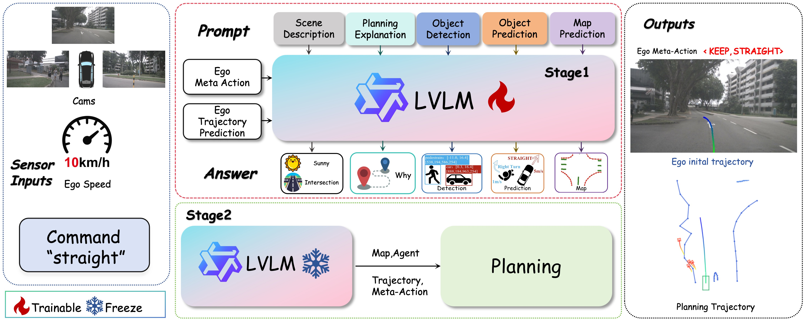

# 🚗 VPM-AD: Integrating LVLM with Planning Module for End-to-End Autonomous Driving
<p align="center">
  
</p>

<p align="center">
  <video src="case_video.mp4" controls style="max-width:100%; height:auto;">
    Your browser does not support the video tag.
  </video>
</p>

## 📋 Project Status

- [x] **Stage 1 (NIPS submission)**
- [ ] **Stage 2 (Code and model release)**

---

## 🚀 Quick Start Guide

Follow these steps to set up and run the project smoothly:

---

### 1. ⚙️ Environment Setup

Set up your Python environment:

```bash

conda create -n vpm_ad python=3.10
conda activate vpm_ad

cd VPM-AD
export PYTHONPATH=/path_to_your_project/VPM-AD
pip install -e "".[torch,metrics]" --no-build-isolation
pip install -r requirements.txt

```
> **Optional (performance boost):** Install [Flash-Attention](https://github.com/Dao-AILab/flash-attention) by following the instructions in its repository.
---

### 2. 📂 Stage 1: Data Preparation
> **Prerequisites:** Please ensure you have prepared [nuScenes](https://www.nuscenes.org/) and download [Qwen2.5-VL 7B](https://huggingface.co/Qwen/Qwen2.5-VL-7B-Instruct) and [72B](https://huggingface.co/Qwen/Qwen2.5-VL-72B-Instruct) checkpoints to any path.

Generate training data by running the following commands sequentially:

```bash
conda activate vpm_ad
export PYTHONPATH=/path_to_your_project/VPM-AD

python3 vpm_tools/VLM_nuData_convert_useGT.py
python3 vpm_tools/VLM_nuData_convert_useQwen.py
python3 vpm_tools/merge_VLM_json.py
```

> **Note:** To enhance efficiency, data is generated in slices and then merged to obtain the final dataset.

---

### 3. 🏁 Stage 1: Training

**Move the prepared training data:**

```bash
mv path/to/train_vqa_data.json data/
```

**Single-GPU Training:**

```bash
llamafactory-cli train examples/train_full/qwen2vl_full_sft.yaml
```

**Multi-GPU Distributed Training:**

```bash
FORCE_TORCHRUN=1 NNODES=2 NODE_RANK=0 MASTER_ADDR=192.168.0.1 MASTER_PORT=29500 llamafactory-cli train examples/train_lora/qwen2vl_full_sft.yaml
```

> **Note:** Final checkpoints are saved in `outputs/qwen2_5_vl-full`.

---

### 4. 🚦 Stage 2: Data Preparation

Prepare trajectory data by executing:

```bash
python vpm_ad/data_generation/generateTrainTrajectory.py
python vpm_ad/utils/merge_json.py
```

---

### 5. 🎯 Stage 2: Training

Train using PyTorch Distributed Training:

```bash
torchrun --nproc_per_node=8 vpm_ad/Planning_Module/planModel.py \
    --batch_size=8 \
    --output_dir=./checkpoints \
    --train_data=/path/to/train_data.json \
    --val_data=/path/to/val_data.json
```

---

### 6. 📊 Evaluation

Evaluate model performance:

- **Stage 1:**

```bash
python3 vpm_tools/evaluation/evalMetaAction.py
```

- **Stage 2:**

```bash
python vpm_ad/Planning_Module/planModel.py --eval
```

---

### 7. 📈 Visualization and Qualitative Analysis
> The visualization code will be released in the future.
Use the following scripts to generate visualizations and qualitative examples:
<p align="center">
  
</p>
---
## 🙏 Acknowledgments

We would like to thank the [LLaMA-Factory](https://github.com/hiyouga/LLaMA-Factory) ,[Qwen2.5-VL](https://github.com/QwenLM/Qwen2.5-VL)projects, which greatly inspired and supported parts of our implementation.
---
## 📄 License

This project is released under the MIT License. See the [LICENSE](LICENSE) file for details.


